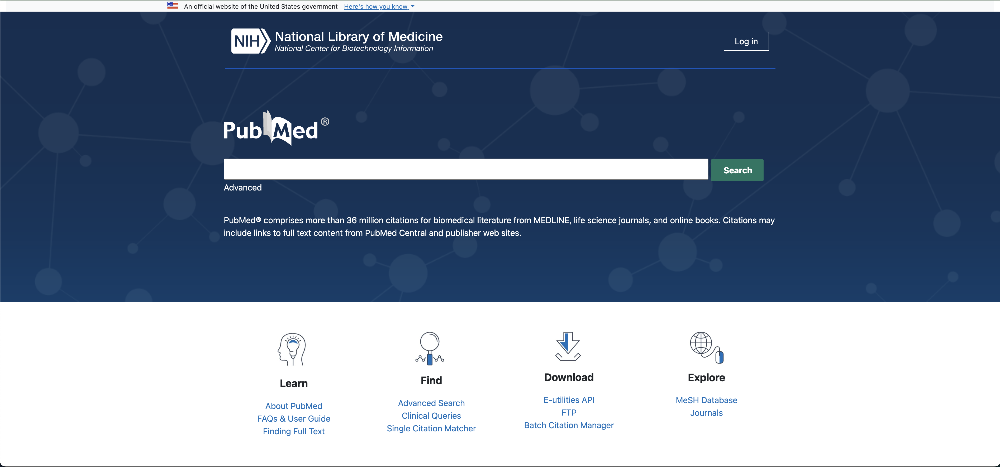

User Interface (UI) frameworks, like Sour Patch Kids, are sour then sweet. At first, learning an html/css framework like Bootstrap is a terrible experience. However, though they are complex, frameworks offer a myriad of advantages that outweigh the initial investment of time and (innumerable) frustrations that come with learning them.

## The Learning Curve: Sour…

UI frameworks come with their own set of classes, components, and a daunting learning curve. However, it's essential to recognize that these complexities serve a greater purpose: to provide developers with tools to streamline and improve the web development process.

## …Then Sweet

### Efficiency and Consistency

One of the primary benefits of UI frameworks is efficiency. Pre-built components, styles, and layouts save developers a significant amount of time. For example, Bootstrap 5 offers a comprehensive set of ready-to-use components: navigation bars, buttons, and responsive grids. These components are designed to work seamlessly together, ensuring consistency in design and functionality across an entire project.

In comparison, the effort required to handcraft that kind of responsive design is immeasurable. Bootstrap 5 eliminates the need for this effort and makes it easier for a beginner-developer to create a website.

### Responsiveness and Cross-Browser Compatibility

Bootstrap 5 excels in responsiveness, ensuring that websites look and function well on devices of all sizes. Responsive design is no longer a nice-to-have but a necessity in our world of mobile devices. Bootstrap in particular simplifies this aspect of web development.

Moreover, UI frameworks address cross-browser compatibility. They have teams dedicated to testing and ensuring that their components work correctly on different browsers and versions. This means less time spent troubleshooting browser-specific issues.

### Community and Documentation

UI frameworks like Bootstrap have large communities and extensive documentation. This wealth of resources – forums, tutorials, examples – is vital to developers of all stages. If you encounter a problem or need to learn a new feature, it’s very likely that someone in the community has faced the same challenge and can provide guidance.

### Using Boostrap 5 to replicate a website:

The first image is is the original PubMed website. Next, my replication using Twitter Bootstrap 5. I was able to accomplish this in about one day, when it may have taken several days using normal HTML and CSS. By getting my hands dirty, I was able to learn about new, beneficial classes from the framework that allowed me to position elements in ways that I wanted. It was a glimpse into the power and wonder of a UI framework.

## Conclusion: The Value of UI Frameworks

The use of UI frameworks like Bootstrap 5 offers several advantages that make the sour learning curve worthwhile. These frameworks simplify web development, improve efficiency, ensure responsiveness and cross-browser compatibility, enable customization, and provide access to vibrant communities and documentation.

While raw HTML and CSS are essential skills for web developers, UI frameworks act as powerful tools in a developer's arsenal. They enable the creation of robust, visually appealing, and user-friendly web applications in less time and with fewer headaches. Embracing UI frameworks like Bootstrap 5 ultimately empowers developers to focus on what truly matters: creating exceptional web experiences that captivate users and meet project goals.
