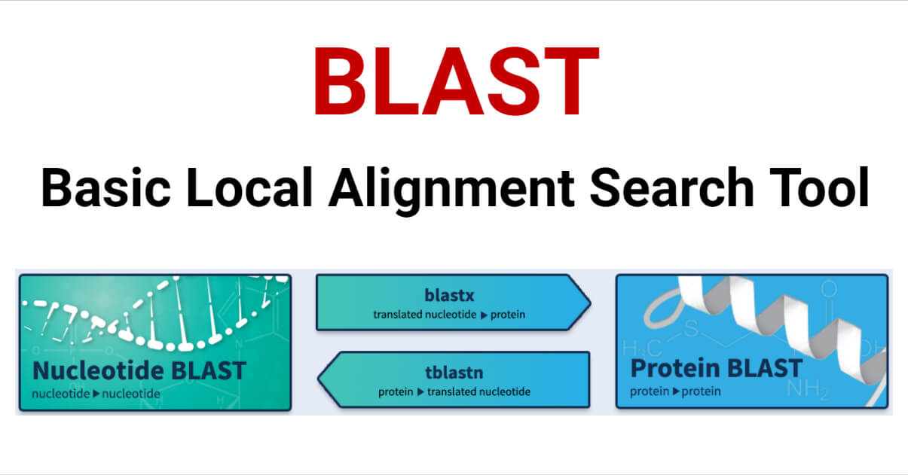

Software engineering is an immense, multifaceted field. It is used to build complex applications and architecture. It reaches into the realm of data science and artificial intelligence. It makes the games we know and love. It saves lives. The wide breadth that software engineering reaches is what makes it such a powerful tool – a tool that I want to master.

## A Native Hawaiian software engineer

As a Native Hawaiian student, one of my goals is to reconcile the Hawaiian language and culture with the field of Computer Science. At first, they seem like disparate subjects. But there are so many ways that software engineering can inform and improve how we communicate with each other, how we learn. 

## Bioinformatics

Another field I am deeply interested in is bioinformatics. When I first entered college, I majored in Molecular Biosciences and Biotechnology – which is quite different than computer science. As a result of my biology background and my desire to enter the field of computer science, I segued into bioinformatics, the discipline of computers and biology. 

My goal is to use the techniques and skills that come from software engineering and apply them to my study of cancer bioinformatics. For instance, BLAST (Basic Local Alignment Search Tool) lets biologists from across the entire world search for protein and nucleic acid sequences to identify species, design primers and guide RNAs, and so much more. The intersection between biology and software engineering has never been more prominent!

## What I want to learn

I have only just begun my journey as a student of software engineering, yet I am exhilarated by the vast world it has sewn together. As technology evolves, I hope to grow alongside it, learning new languages and ideas. I’m eager to embrace the challenge and the opportunities to come.
