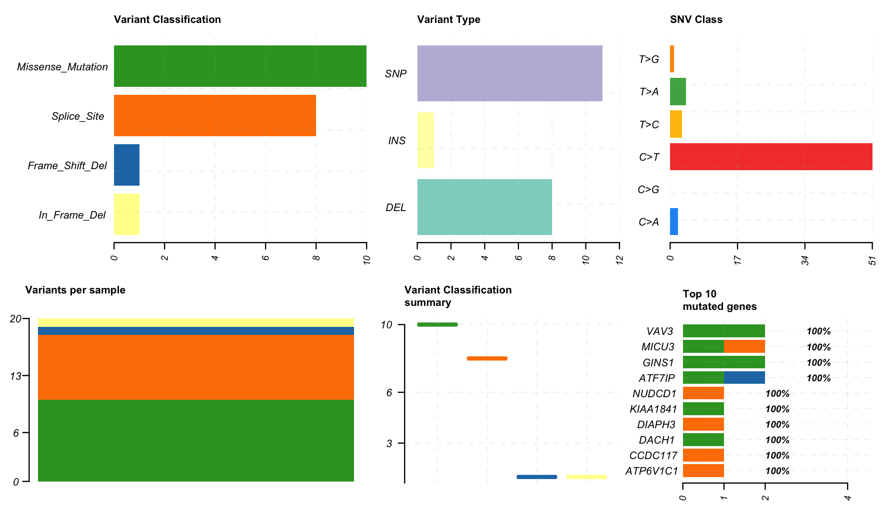

## Colorectal cancer and biomarkers
Colorectal cancer (CRC) is the fourth most common cancer and second most common cause of cancer-related death in the United States. Furthermore, its incidence and mortality rates demonstrate disparities across different racial/ethnic populations. 

This research project aims to identify and analyze biomarkers associated with CRC by analyzing publicly available datasets from sources like the Database of Genotypes and Phenotypes (dbGaP) and the International Cancer Genome Consortium (ICGC). It will also focus on the unique context of multiethnic health disparities in CRC.

## Analysis of whole genome sequences
Whole genome or exome sequencing data will be used to comprehensively examine genetic and metabolic changes caused by CRC development. By integrating these multi-omics data, this project aims to gain a deeper understanding of differing molecular processes behind CRC in Native Hawaiian, African-American, Asian, and other ethnic populations.

## Software and languages used
This project requires the use of several programming languages and software. Because whole genome sequencing is big data, a Linux server is used to store the files containing the genome sequences. A Python script will be used to generate the input files that are submitted to the Cromwell server, a workflow management tool that carries out the analysis from raw genome sequences to annotated mutation files. This will then allow for downstream analysis. Below is an example of a visualized .maf file of a single cancer genome that was put through the Cromwell pipeline:

  

## Future directions
This is a continuing project that I will pursue until I complete my undergraduate degree. I hope to not only learn more technical skills, but to become better at communicating my research and improving it with the things I learn from my coursework.

