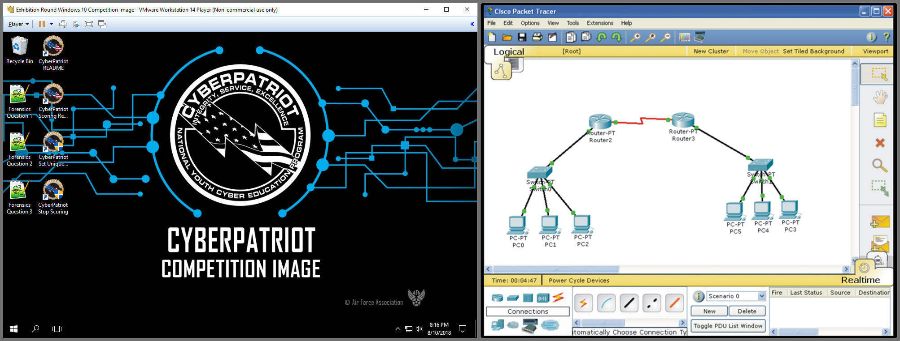

  

Cyberpatriots is a cybersecurity education program for youth across the United States. Students will compete in cybersecurity competitions.

The rounds take place online, with 8 hours allocated to attempt to solve the problems.

I competed in the Cisco portion of the competition. This involved the use of a simulated network of routers, switches, and computers that I had to navigate and use the command line on in order to solve a problem. 
